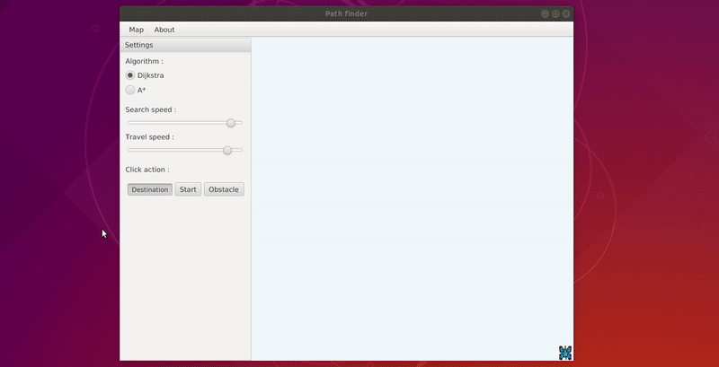
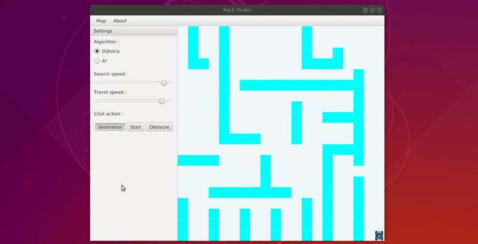
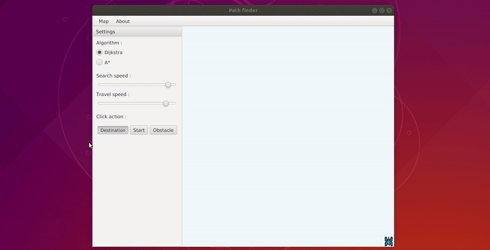

# PathPlanner
A graphical tool to simulate robot path planning with obstacles using two different algorithms : Dijkstra and A*

This program is developed using javaFx, it allows you to select a starting point in the map and then set the destination to start the path search algorithm. The two available algorithms are Dijkstra and A*.

You can draw your own obstacles map and save it to use it later. 

The source code is available in the src/sample directory.
You can execute it directly using the executable jar file is in the Jar directory.
